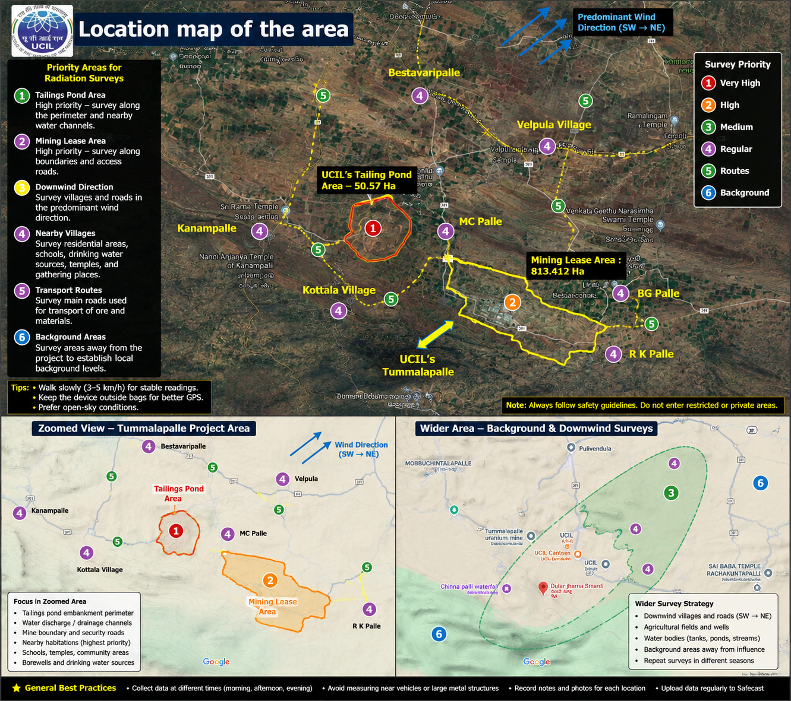
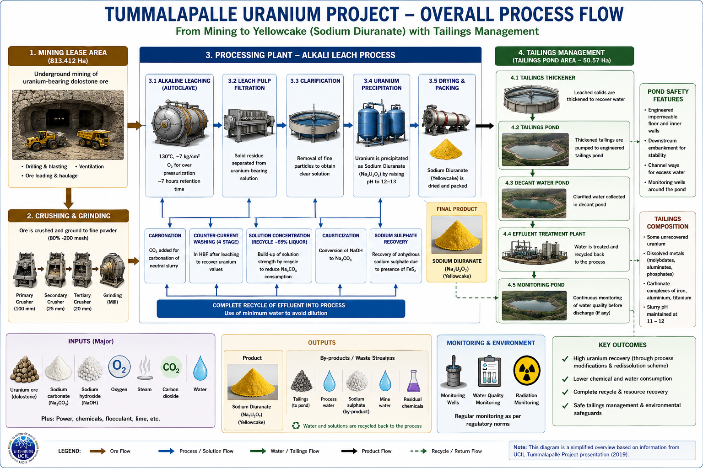
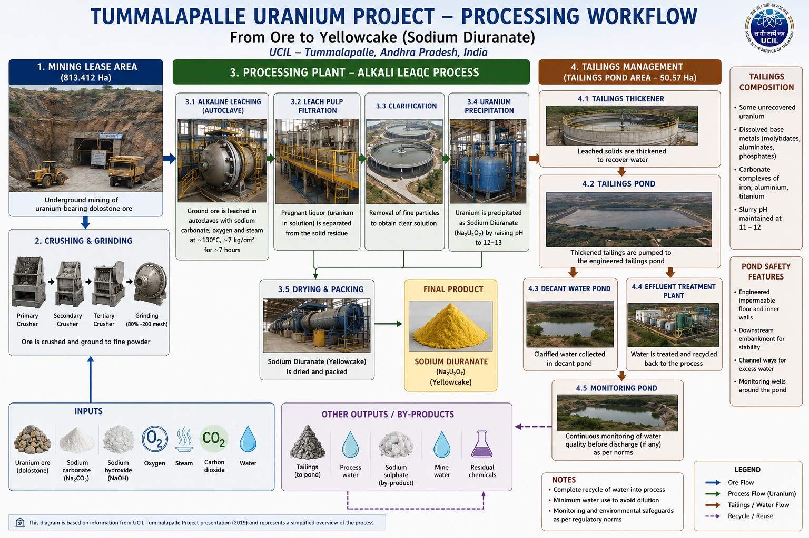
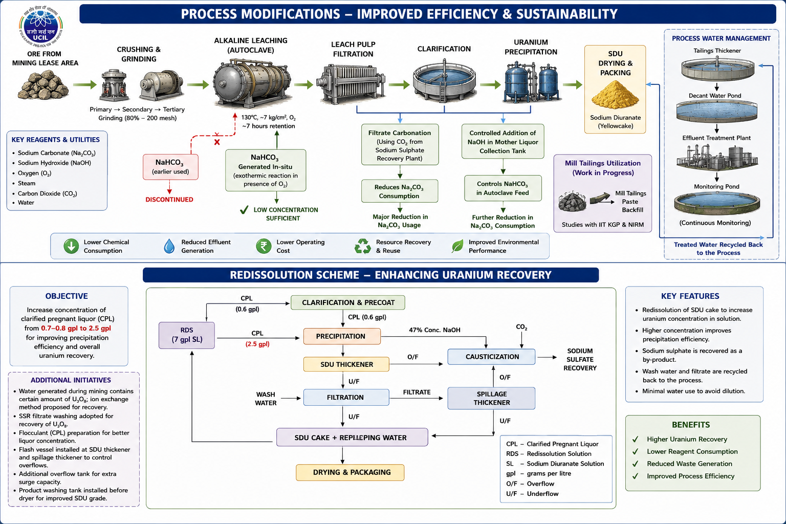

# Safecast Analysis – Tummalapalle Uranium Project

Citizen-science radiation mapping project based in Pulivendula, Andhra Pradesh, India.

---

## Background

In 2026, I relocated to Pulivendula, Andhra Pradesh, for a year of self-study.

While traveling through the region in 2025, I observed many people traveling to hospitals in Kadapa. Although such observations alone do not establish any environmental connection, they motivated me to learn more about the area and contribute objective environmental measurements.

Pulivendula is located near the Tummalapalle Uranium Project operated by Uranium Corporation of India Limited (UCIL). After learning about Safecast's open-data approach to environmental monitoring, I began collecting and publishing radiation measurements using a Safecast bGeigieZen.

The purpose of this repository is to collect, organize, analyze, and publish environmental radiation measurements.

The goal is not to prove or disprove any particular claim, but to make measurements openly available for public review.

---

## About Safecast

Safecast is a global citizen-science organization that enables individuals to collect and share environmental radiation measurements.

- Website: https://safecast.org
- SimpleMap: https://simplemap.safecast.org

---

## Equipment

### Safecast bGeigieZen

Portable GPS-enabled radiation survey instrument used to:

- Record CPM (Counts Per Minute)
- Record GPS coordinates
- Produce georeferenced survey logs
- Upload measurements to Safecast

Operational notes from field testing:

- Flat-top 18650 batteries are recommended.
- GPS reception is best under open sky.
- Device placement inside bags may reduce GPS signal quality.
- Invalid GPS fixes may appear as:
  - `0000.0000`
  - GPS flag `V`

---

# Project Maps & Diagrams

## 1. Radiation Survey Planning Map



This map highlights:

- Tailings Pond Area
- Mining Lease Area
- Nearby Villages
- Transportation Routes
- Potential Downwind Survey Areas
- Background Measurement Locations

Priority areas include:

1. Tailings Pond perimeter
2. Mining lease access roads
3. Villages near project boundaries
4. Water channels and drainage routes
5. Background locations away from project influence

---

## 2. Overall Tummalapalle Process Flow



This diagram summarizes the complete project:

### Inputs

- Uranium-bearing dolostone ore
- Sodium carbonate
- Sodium hydroxide
- Oxygen
- Steam
- Carbon dioxide
- Water

### Main Process Stages

1. Underground mining
2. Crushing
3. Grinding
4. Alkaline leaching
5. Filtration
6. Clarification
7. Uranium precipitation
8. Drying and packaging

### Outputs

- Sodium Diuranate (Yellowcake)
- Tailings
- Process water
- Sodium sulphate
- Residual materials

---

## 3. Detailed Processing Workflow



This figure focuses on the alkali leach process.

### Key Features

- Three-stage crushing
- Fine grinding (~80% passing 200 mesh)
- Alkaline leaching at approximately:
  - 130°C
  - Oxygen pressurization
  - ~7 hour retention
- Clarification and filtration
- Sodium diuranate precipitation
- Tailings management and water recycling

### Tailings Management Components

- Tailings Thickener
- Tailings Pond
- Decant Water Pond
- Effluent Treatment Plant
- Monitoring Pond

---

## 4. Process Modifications & Redissolution Scheme



This diagram summarizes improvements made to increase uranium recovery and reduce resource consumption.

Highlights include:

### Process Improvements

- Reduced sodium carbonate consumption
- In-situ bicarbonate generation
- Increased recycle of process liquors
- Improved precipitation efficiency
- Lower water consumption
- Enhanced environmental performance

### Redissolution Scheme

The redissolution process increases uranium concentration before precipitation and improves recovery efficiency while reducing waste generation.

---

# Areas of Interest

## Pulivendula

Primary survey base and operational center.

## Tummalapalle Uranium Project

Located approximately 12 km south of Pulivendula.

Major components include:

- Underground mine
- Processing plant
- Tailings management area
- Water treatment facilities
- Monitoring infrastructure

## Nearby Villages

- Tummalapalle
- Kottala
- Velpula
- Bestavaripalle
- MC Palle (Mobbuchintalapalle)
- BG Palle (Bhumaiahgaripalli)
- RK Palle (Rachakuntapalli)
- Kanampalle

---

# Repository Structure

```text
safecast-analysis/
├── README.md
├── data/
│   ├── drives/
│   ├── journals/
│   ├── gnss/
│   └── images/
├── output/
└── scripts/
```

---

# Safecast Uploads

Approved imports:

https://api.safecast.org/en-US/bgeigie_imports?by_status=done&by_user_id=11754&locale=en-US

---

# Pulivendula Radiation Map

Current map view:

https://simplemap.safecast.org/?minLat=14.41367&minLon=78.21656&maxLat=14.43217&maxLon=78.23665&zoom=16&layer=OpenStreetMap&unit=uSv&legend=1&coloring=safecast&lang=en&place=Pulivendula

---

# Workflow

1. Collect data with bGeigieZen
2. Copy `.log` files from device storage
3. Store logs in `data/drives/`
4. Upload logs to Safecast
5. Verify approval status
6. Review measurements on Safecast SimpleMap
7. Compare surveys over time

---

# Credits

Measurements collected and uploaded by Anand Sandhinti.

Data contributed to the Safecast open-data environmental monitoring network.
